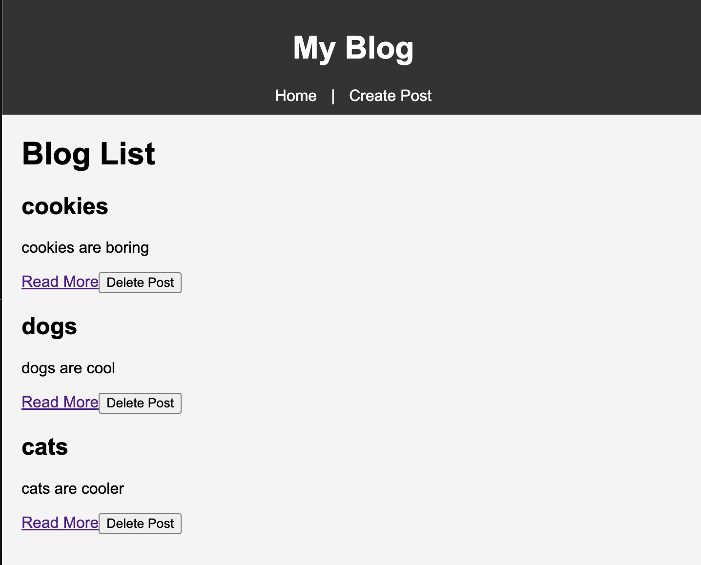

# BlogApp 

## Introduction

BlogApp is a user-friendly blogging platform. It is built using Vue.js for the frontend and Node.js with Express.js for the backend. This application simplifies the process of blogging by providing functionalities to create, view, and manage blog posts.

## Project Setup

### Backend

1. **Navigate to the Backend Directory**:

   ```
   cd backend
   ```

2. **Install Necessary Packages**:

   ```
   npm install
   ```

3. **Start the Server**:
   ```
   npm start
   ```
   - The server runs on `http://localhost:5000` by default.

### Frontend

1. **Navigate to the Frontend Directory**:

   ```
   cd frontend
   ```

2. **Install Necessary Packages**:

   ```
   npm install
   ```

3. **Serve the Application**:
   ```
   npm run serve
   ```
   - The application is accessible at `http://localhost:8080` by default.

## Features

- **Create New Blog Post**: Users can write and publish new blog posts.
- **View Blog Posts**: Browse through a list of all available blog posts.
- **Read Blog Post**: Click on any blog post to read its full content.
- **Delete Blog Post**: Remove blog posts that are no longer needed.

Thank you for using BlogApp! Happy blogging! 📝✨
